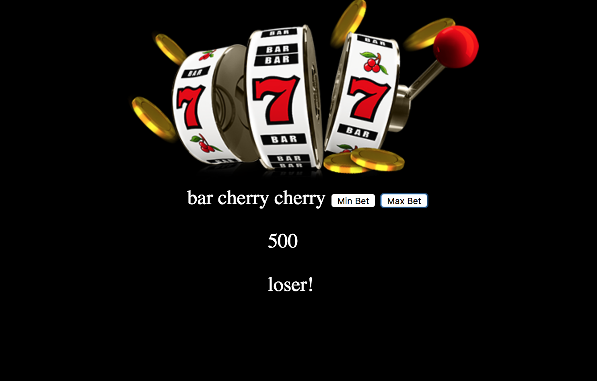

# SLOT-MACHINE PROJECT
I made a slot-machine application with 3 reels, each with 5 options. The user can make a minimum and maximum bet which have different payouts. Upon winning or losing, a message is displayed.

## How It's Made:

**Tech used:** HTML, CSS, JavaScript

This code randomaly generated reels that had a function for checking the reels and changing the HTML based on the results of the reels.

## Optimizations
The slot machine could be better if the reel images were displayed for each reel option giving visuals to the game. I would also add a jackpot option in the future to allow larger winnings.

## Lessons Learned:

I learned how to use apply the math.Random method to target my reels.
